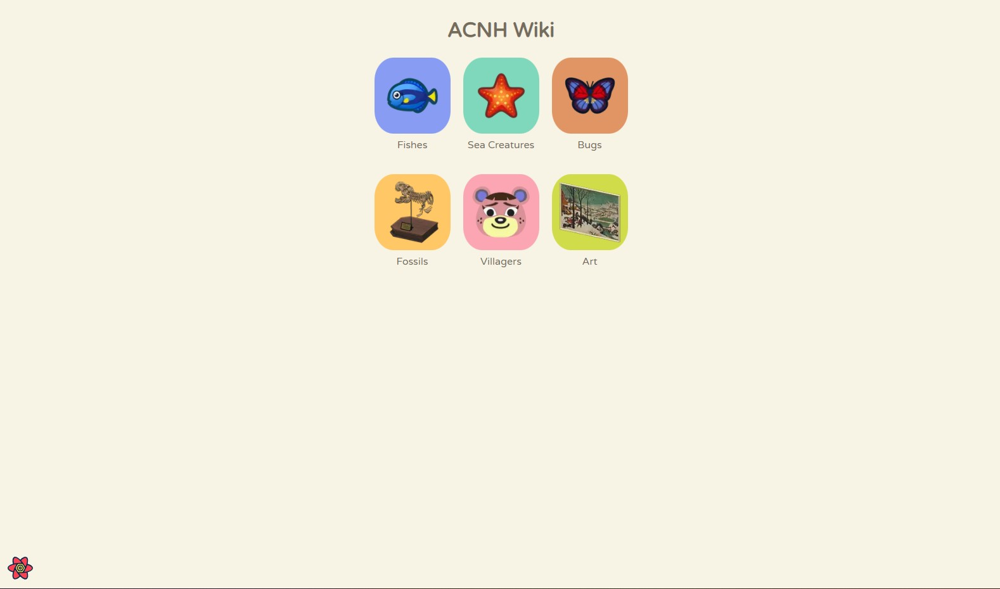
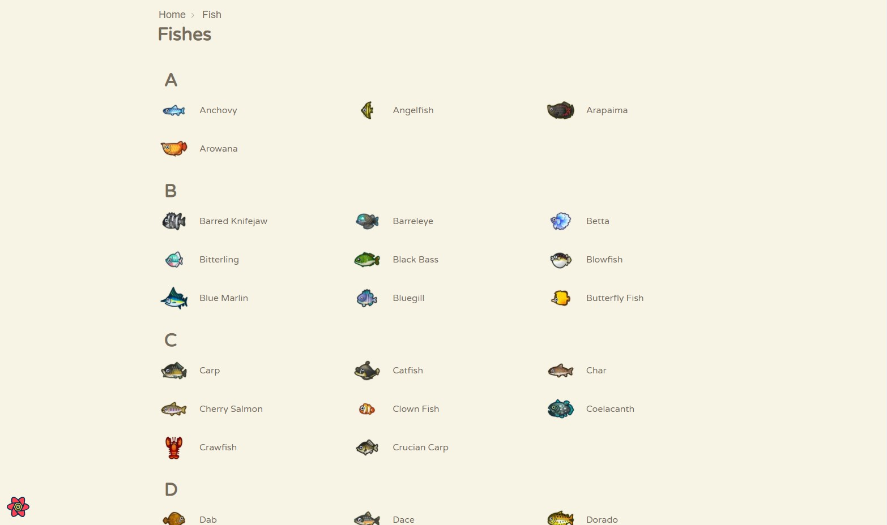
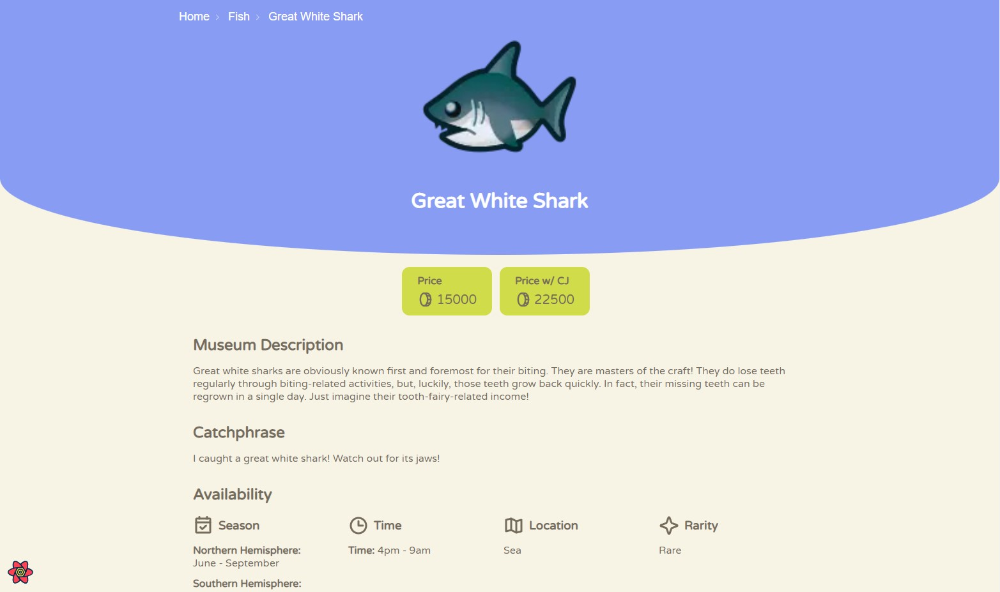

# Animal Crossing: New Horizons Wiki (API Consumer)

This is a simple application that would show different items found in the game *Animal Crossing: New Horizons*.

You can check below my reasoning on certain implementations. I also have setup a template/boilerplate which I often use for my personal projects. But since it already includes a CSS Framework ([Chakra-UI](https://chakra-ui.com/)), I implemented this one from scratch. If you're interested, you could check it out [here](https://github.com/carldegs/nextjs-typescript-boilerplate).

## React Toolchain

For small projects, I often use CRA since it allows faster tooling. But then, there are issues with CRA slowing down on development once the project becomes bigger, and ejecting can be messy.

Currently, my go-to toolchain/framework for web apps is NextJS. Some reasons why I chose this:

1. A lot of features are already being handle by NextJS (e.g, Built-in support for CSS, SASS, ESLint and Typescript) , making it useful for projects that has a quick turnaround (e.g, this one).
2. The built-in router lets you not worry about routing altogether and just implement it using your file routing. One disadvantage is that your code will be more opinionated, but if you are using Atomic Design - which would also help with scalability - this wouldn't be an issue.
3. Allows you to create server-rendered (SSR) pages, but still set other pages as statically-generated (SSG) or client-rendered.

## API

The app uses the [ACNH API](http://acnhapi.com/). This include data for different groups from the game. Items shown in the web app are:

1. Fishes
2. Sea Creatures
3. Bugs
4. Fossils
5. Villages
6. Art

## Pages

### Home Page - `/`

Contains links to the different groups of the game.

### Group Page - `/[group]`

Shows list of items within the group.

### Item page - `/[group]/[item]`

Show item information. It should be noted that the information available to each group is different. The typings can be seen at `/src/types`.

Note: If we assumed that no more items will be added in the game, we could make the group and item pages to be statically-generated. This gives us the benefit of the page being cache-able in a CDN/Edge network.

## UI

The UI is based on the player's in-game phone UI.

### CSS-in-JS

For handling CSS, I used [Emotion](https://emotion.sh/docs/introduction) mainly due to it's Object styles feature which allows us to pass css properties as an object and give us typings that would increase developer experience. I also used `facepaint` which allows us to define css properties at different breakpoints as an array. This would reduce the time coding repetitve media queries.

To be frank, this is my first time using Emotion and facepaint but this implementation is very similar to how Chakra-UI handles breakpoints. Usually, my projects either use Chakra-UI or Styled Components.

## State Management

Recently, I moved away from using Redux, a client-state state manager, to [React Query](https://react-query.tanstack.com/), a server-state state manager.

React Query is responsible for managing asynchronous operations and caching the response. This library replaces the boilerplate code of Redux and whatever middleware used for handling asynchronous calls (e.g, Redux Thunk/ Redux Toolkit). Instead of needing to create thunks, reducers, and actions, we could just call a hook (or create a "wrapper" hook) and it would handle the asynchronous operation. Another advantage is it's ability to pre-fetch data on the server using *Hydration*. This allows us to pre-render a page that is available on page load, then populate/dehydrate the queries once JS is loaded on the client-side.

For other client-side states that needs to be managed, a simple Context hook will suffice.

## Linting

The lint ruleset I've used is the same as the one I used for my template. This is based on the recommended ESLint ruleset with plugins to handle rules for React, React Hooks (this one helps in setting up hook dependencies) and digital accessibility (jsx-a11y), and a prettier plugin to automatically sort imports.

I also installed Husky to handle pre-commit checks to prevent incorrect code from being pushed.
